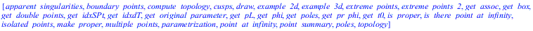
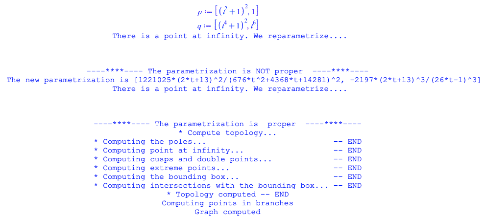

PTOPO
==

## Load PTOPO

```maple
restart;
# Requirements:
SLV_PATH := "path/to/SLV/":
PTOPO_PATH := "path/to/PTOPO/":
read cat(SLV_PATH, "SLV.mpl");
read cat(PTOPO_PATH, "ptopo.mpl");
``````


```
with(PTOPO);
```



The PTOPO package is designed to offer easy to use functions providing the full functionality.  

Advanced users can break down the computation in more steps if they wish.

## Elementary usage

The easiest way to see the topology of a curve is to call the draw function with arguments the parametrization of the curve.

The output graph contains all the interesting points of the curve:
- in red box are the multiple points and cusps
- in red asterisk are the isolated points 

- in maroon circle are the extreme points with respect to the coordinate axis or planes
- in black circle are the points intersecting the bounding box and intermediate points sampled on the arcs

Additionally, for 3D curves, we perform a random projection of the curve to the plane. Then:
- in blue box are the apparent singularities (i.e., the sungularities of the projected curve)
- in khaki circle are the extreme points of the projected curve

*Note that since the projection is random, the apparent singularities and the extreme points of the projected curve may differ among executions.*

## Initialize the parametrization
```
p := [ (t^2 + 1)^2, 1];
q := [(t^4 + 1)^2, t^6];
PTOPO:-draw(p, q);
```


## Compute the topology
## Points of interest
## Draw
## Examples